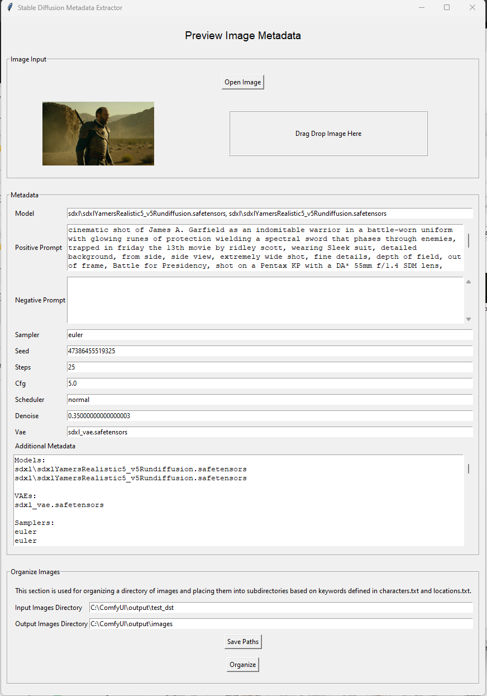

# SD-Image-Organizer



## Description
SD-Image-Organizer is a tool for organizing images generated by AI. It uses the metadata within the images to place them into subdirectories based on user-defined keywords specified in a text file.

## Features
- Extracts metadata from AI-generated images
- Organizes images into subdirectories based on metadata
- Supports drag and drop for image files
- Configurable directories for image sources and outputs

## Installation
1. Clone the repository:
    ```sh
    git clone https://github.com/yourusername/SD-Image-Organizer.git
    ```
2. Navigate to the base directory:
    ```sh
    cd SD-Image-Organizer
    ```
3. Install the required packages:
    ```sh
    pip install -r requirements.txt
    ```

## Usage
1. Edit the `data/config.json` file to specify the directory paths.
2. Run the application:
    ```sh
    python main.py
    ```

## Configuration
- `base_dir`: Path to the directory containing the images to be organized.
- `output_dir`: Path to the directory where organized images will be saved.

## Version
1.0

## License
This project is licensed under the MIT License.
